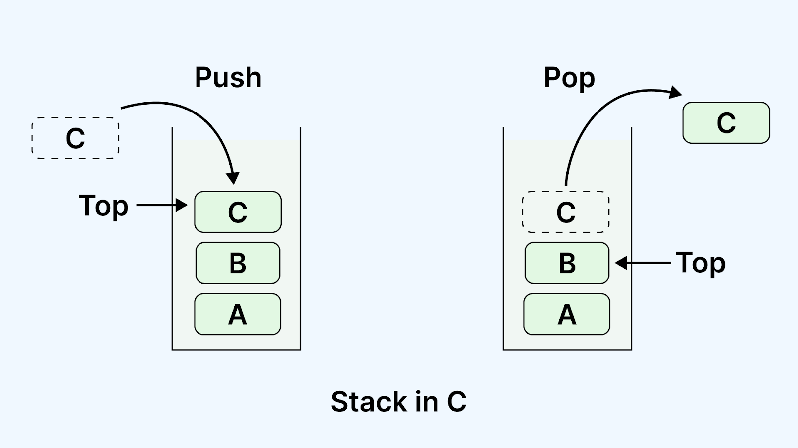

# 2-3 新增、刪除與插入

## append()：在清單尾端新增元素

```python
fruits = ['apple', 'banana']

fruits.append('cherry')
print(fruits)   # ['apple', 'banana', 'cherry']
```

::: warning 注意
`append()` 一次只能新增**一個元素**。如果傳入一個清單，會把整個清單當作「一個元素」加進去：

```python
fruits = ['apple', 'banana']
fruits.append(['cherry', 'durian'])
print(fruits)   # ['apple', 'banana', ['cherry', 'durian']]
```

若想把另一個清單的元素逐一加入，請改用 `extend()`。
:::

## remove()：依「值」刪除元素

`remove()` 會刪除清單中**第一個**符合指定值的元素。

```python
fruits = ['apple', 'banana', 'cherry', 'banana']

fruits.remove('banana')
print(fruits)   # ['apple', 'cherry', 'banana']
```

::: warning 常見錯誤：值不存在時會發生錯誤
若指定的值不在清單中，`remove()` 會產生 `ValueError`：

```python
fruits = ['apple', 'banana']
fruits.remove('mango')   # ValueError: list.remove(x): x not in list
```

使用前建議先用 `in` 確認元素存在：

```python
if 'mango' in fruits:
    fruits.remove('mango')
else:
    print('找不到該元素')
```
:::

::: tip del vs remove

- `del list[index]`：依**索引位置**刪除。
- `list.remove(value)`：依**內容值**刪除（找到第一個符合的）。
:::

## pop()：取出並刪除指定位置的元素


`pop()` 會刪除指定索引的元素，**並回傳被刪除的值**。若不指定索引，預設刪除並回傳最後一個元素。

```python
fruits = ['apple', 'banana', 'cherry']

last_item = fruits.pop()
print(last_item)   # cherry
print(fruits)      # ['apple', 'banana']

first_item = fruits.pop(0)
print(first_item)  # apple
print(fruits)      # ['banana']
```

::: warning 常見錯誤：對空清單呼叫 pop()
若清單已經是空的，呼叫 `pop()` 會產生 `IndexError`：

```python
empty = []
empty.pop()   # IndexError: pop from empty list
```

使用前可先確認清單不為空：

```python
if fruits:
    item = fruits.pop()
```
:::

## clear()：清空清單

```python
fruits = ['apple', 'banana', 'cherry']

fruits.clear()
print(fruits)   # []
```

## 本節方法一覽

| 方法 | 說明 | 會回傳值？ |
|------|------|-----------|
| `append(x)` | 在尾端新增一個元素 | 無 |
| `remove(x)` | 刪除第一個值為 x 的元素 | 無 |
| `pop(i)` | 刪除並回傳索引 i 的元素（預設最後一個） | ✅ 是 |
| `clear()` | 清空清單 | 無 |
| `extend(lst)` | 將另一個清單的所有元素加入尾端 | 無 |
| `insert(i, x)` | 在索引 i 位置插入元素 x | 無 |
| `del list[i]` | 刪除索引 i 的元素 | 無 |

### 自主練習

1. 建立清單 `colors = ['red', 'green', 'blue']`，使用 `append()` 新增 `'yellow'`，再使用 `insert()` 在最前面插入 `'black'`。
2. 給定 `nums = [1, 2, 3, 4, 5, 6]`，使用 `del` 刪除索引 `1` 到 `3`（不含索引 3）的元素，印出結果。
3. 給定 `data = [10, 20, 30, 20, 40]`，使用 `remove()` 刪除第一個 `20`，觀察結果。
4. 使用 `pop()` 依序取出並印出清單 `[1, 2, 3]` 中的每一個元素，直到清單為空。